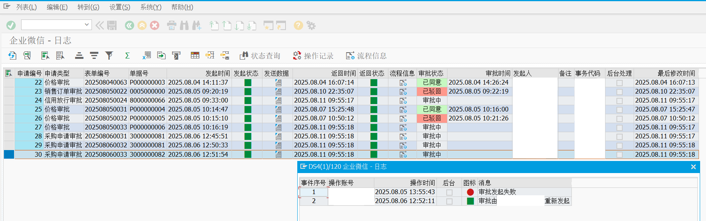

# SAP WeChatWork Approval Framework

This framework simplifies the development of approval functions in WeChatWork by providing pre-built components and templates.

## News

🎉 Now you can upload this project directly in ABAP Trial Docker!

## Features

- **Approval Process Management**: Create, send and track approval requests
- **User Mapping**: Automatically map SAP users to WeChatWork users via phone numbers
- **Template Support**: Pre-defined approval templates for common scenarios
- **Form Controls**: Various form controls (text, number, date, selector, table etc.)
- **Logging**: Comprehensive logging of approval events and data
- **Status Tracking**: Track approval status and results
- **Scheduled Jobs**: Automatic approval result checking via scheduled jobs

<div align="center">
  
  
  **Figure 1**: WeChat approval event log interface
</div>

## Core Components

| Class | Description |
|-------|-------------|
| `zcl_wx_approval` | Main approval handling class |
| `zcl_wx_config` | WeChatWork configuration loader |
| `zcl_wx_oa_ft` | Approval template management |
| `zcl_wx_oa_fc` | Form controls for approvals |
| `zcl_wx_log_data` | Approval data logging |
| `zcl_wx_log_event` | Approval event logging |
| `zcl_wx_cache` | Token caching mechanism |

## Detailed Workflow

### 1. Code Generation from Template

The `ztool_wechat_approval_temp` program generates boilerplate code based on WeChatWork approval templates:

1. Execute transaction `SE38` and run program `ztool_wechat_approval_temp`
2. Enter template ID from WeChatWork (e.g. `C4ZXKAttHPFgVA7gQh57zwCgzgeMQ9BN4aC3BVbud`)
   - You can find the ID in the Approval Template Configuration page URL
3. The program will generate complete ABAP code including:
   - Interface initialization with WeChat API
   - Basic assignment (creator, template ID)
   - Control assignments for each form field
   - Send approval call structure

**Key Points:**
- Generated code needs manual copying to your implementation class
- Replace `fixme` placeholders with actual values
- Required fields are marked with comments

Example generated code snippet:
```abap
" ------------------- 接口初始化 ----------------------
DATA(l_approval) = NEW zcl_wechat_approval( corpid = `fixme` corpsecret = `fixme` ).

" ------------------- 控件赋值 ----------------------
" 控件: Text 示例字段1 - 文本
" 赋值:必输
DATA(l_01_text) = NEW zcl_wx_oa_fc_text( `Text-1572857932948`
  )->set( '<fixme>' ).
APPEND CAST zif_wx_oa_fc( l_01_text ) TO l_fc->apply_data-contents.
```

### 2. Subclass Implementation

Create a subclass inheriting from `zcl_wx_oa_ft_send` and implement the mapping logic:

1. Create new class inheriting from `zcl_wx_oa_ft_send`
2. Copy relevant generated code from `ztool_wechat_approval_temp`
3. Implement mapping method to handle field assignments
4. Add business logic as needed

Example implementation (`zcl_wx_oa_ft_demo`):
```abap
CLASS zcl_wx_oa_ft_demo DEFINITION
  PUBLIC
  INHERITING FROM zcl_wx_oa_ft_send
  FINAL
  CREATE PUBLIC.

  PUBLIC SECTION.
    METHODS map
      IMPORTING
        !text01         TYPE string    " 示例字段1 - 文本
        !selector02     TYPE string    " 示例字段2 - 选项
        !number03       TYPE string    " 示例字段3 - 数字
      RETURNING
        VALUE(instance) TYPE REF TO zcl_wx_oa_ft_demo.
ENDCLASS.

METHOD map.
  instance = me.

  " 1. 设置摘要信息
  me->ft->set_summary( VALUE #( ( text = '发文审批' lang = 'zh_CN' ) ).

  " 2. 设置文本控件
  DATA(l_text) = NEW zcl_wx_oa_fc_text( `Text-1572857932948` )->set( text01 ).
  APPEND CAST zif_wx_oa_fc( l_text ) TO me->ft->apply_data-contents.

  " 3. 设置选择器控件
  DATA(l_selector) = NEW zcl_wx_oa_fc_selector( 
    id = `Selector-1573203804088`
    type = zcl_wx_oa_fc_selector=>single
  )->set( VALUE #( ( key = selector02 ) ) ).
  APPEND CAST zif_wx_oa_fc( l_selector ) TO me->ft->apply_data-contents.
ENDMETHOD.
```

### 3. Approval Result Processing

The `zjob_wx_approval_result` job periodically checks approval results:

1. Schedule the job via transaction `SM36`
2. Recommended frequency: Every 5-10 minutes
3. Job performs:
   - Fetches pending approvals from WeChatWork
   - Updates SAP system with approval results
   - Triggers follow-up actions based on status

**Configuration:**
```abap
" In job program zjob_wx_approval_result
DATA(lo_processor) = NEW zcl_wx_approval_result( ).
lo_processor->set_check_interval( iv_minutes = 10 ). " Check every 10 minutes
lo_processor->process_pending_approvals( ).
```

## Installation & Configuration

1. **Installation**:
   ```bash
   abapGit pull https://github.com/chunrichi/SAPApproval_WeChat
   ```

2. **Configuration**:
   - Update `zcl_wechat_config` with your WeChatWork credentials
   - Maintain user mappings in SU01 (phone numbers)
   - Configure logging level in `zcl_wx_log_data`

3. **Macro Setup** (required for logging):
   - Open TCode `SM30` to maintain table `TRMAC`
   - Insert new line like:
   ```
   /ZWX/LOG	001	INCLUDE ZWX_CMACRO_LOG.
   ```

## Best Practices

1. **Template Management**:
   - Use descriptive names for template controls
   - Document required fields in template comments
   - Version control your template IDs

2. **Error Handling**:
   ```abap
   TRY.
       lo_approval->send( ).
     CATCH zcx_wx_error INTO DATA(lx_error).
       " Handle WeChat API errors
   ENDTRY.
   ```

3. **Testing**:
   - Use `zdemo_wx_approval_send` for initial testing
   - Verify all required fields are mapped
   - Test with different approval scenarios

## Troubleshooting

| Issue | Solution |
|-------|----------|
| Invalid template ID | Verify template exists in WeChatWork console |
| Missing permissions | Check application permissions in WeChatWork |
| User mapping failed | Verify phone numbers in SU01 match WeChatWork |
| API connection issues | Check network connectivity to WeChat API |

## Support

For issues or questions, please open an issue on [GitHub](https://github.com/chunrichi/SAPApproval_WeChat/issues)
